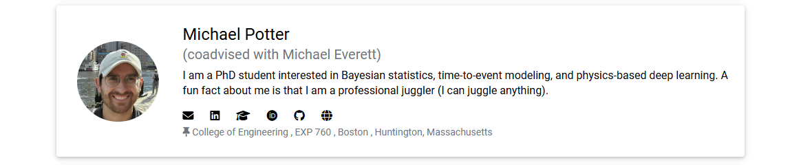
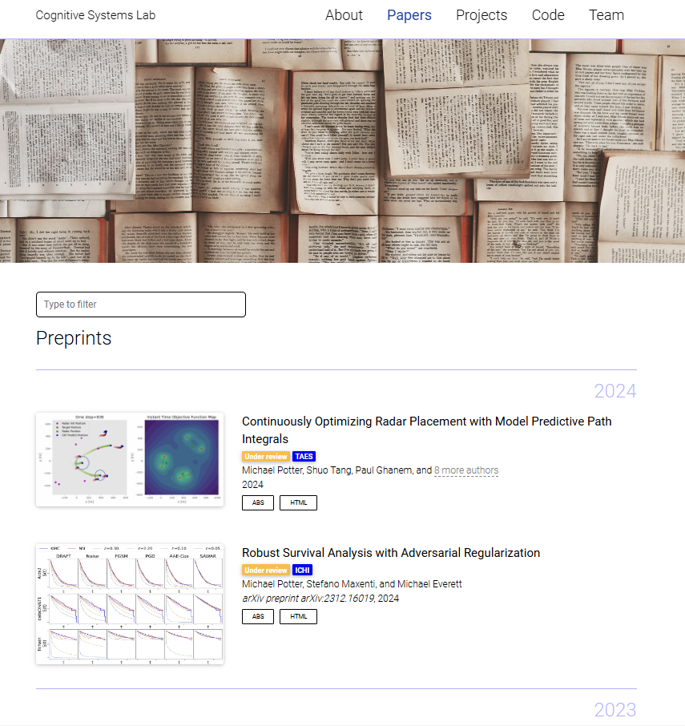
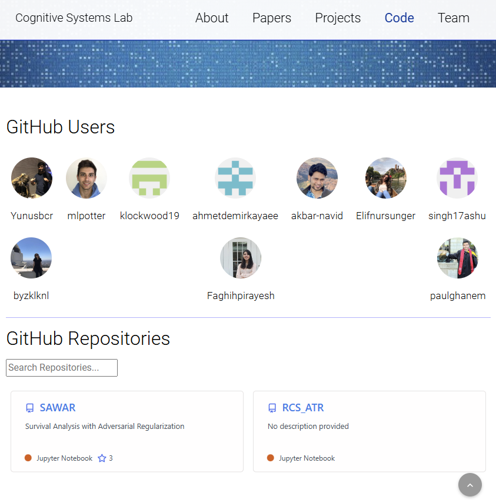

# Cognitive Systems Lab


<div align="center">

[](https://cogsyslab.github.io/nu-csl/)

**A simple, clean, and response [Jekyll](https://jekyllrb.com/) website for the Cognitive Systems Lab**
---

[](https://github.com/alshedivat/al-folio/actions/workflows/deploy.yml)
[](#maintainers)
[](https://github.com/alshedivat/al-folio/graphs/contributors/)

[](https://github.com/alshedivat/al-folio/blob/main/LICENSE)
[](https://github.com/CogSysLab/nu-csl)
[](https://github.com/CogSysLab/nu-csl)

</div>

## Inspiration from other labs

We drew inspiration from many other **al-folio** and [Jekyll](https://jekyllrb.com/) websites, including:

★ <a href="https://kordinglab.com/" target="_blank"> Kording Lab </a> 
★ <a href="https://sanderslab.github.io/" target="_blank"> Sanders Lab </a>
★ <a href="https://fraserlab.com/news/" target="_blank"> Fraser Lab </a>
★ <a href="https://www.allanlab.org/aboutwebsite.html" target="_blank"> Allan Lab</a>
★ <a href="https://drummondlab.org/" target="_blank"> Drummond Lab </a>
★ <a href="https://programming-group.com/" target="_blank"> Programming Group </a>
★ <a href="https://liralab.usc.edu/" target="_blank"> Lira Lab </a>
★

### Preview Site Locally

You can build your GitHub Pages site locally to preview and test changes to your site by following the instructions from github documentation [here](https://docs.github.com/en/pages/setting-up-a-github-pages-site-with-jekyll/testing-your-github-pages-site-locally-with-jekyll).
After following the instructions go to the local repository folder and run the following command (this is just done once unless new gems are added)

```bash
bundle install
```

Then run the following command to build the site and serve it locally

```bash
bundle exec jekyll serve --force_polling
```

## Getting started

Want to learn more about Jekyll? Check out [this tutorial](https://www.taniarascia.com/make-a-static-website-with-jekyll/). Why Jekyll? Read [Andrej Karpathy's blog post](https://karpathy.github.io/2014/07/01/switching-to-jekyll/)! Why write a blog? Read [Rachel Thomas blog post](https://medium.com/@racheltho/why-you-yes-you-should-blog-7d2544ac1045).


## Customizing

For more customization details please refer to [CUSTOMIZE.md](CUSTOMIZE.md) and [al-folio](https://github.com/alshedivat/al-folio)

---

### Add People Profiles
1. Create a new `.md` file in the `_members` directory with the filename as `lastname_firstname.md`
2. Add the following fields to the file:
```yaml
---
layout: about
inline: false
group: Doctoral Researchers
group_rank: 4
team_frontpage: true

title: First Last Name
description: Profile of First Last Name, Doctoral Researcher at the Cognitive Systems Lab
lastname: Last Name
publications: 'author^=*Potter || author^=Michael Potter || renamed^=*Michael Potter' # (these are query filters to link your publications!)
teaser: > # 1-2 sentences shortly describing yourself
    I am a PhD student interested in ...
profile:
    name: First Last Name
    align: right
    image: profile_pictures/<your profile picture name>.jpeg # should be lastname_firstname.jpeg
    role: coadvised with ... # Examples are PhD Candidate, or Coadvised by so and so
    email: <your email>>@northeastern.edu
    linkedin: linkedin username # For example, the username in https://www.linkedin.com/in/username
    website: 
    scholar: google scholar link
    address: >
        College of Engineering<br />
        EXP 760 <br />
        Boston <br />
        Huntington, Massachusetts
---
Michael Potter is a Ph.D candidate ... # Profile description(or whatever markdown / html you want to add)
```
3. Save your profile picture to the `img\profile_pictures` directory. Try to make it as close as possibly to equal width and height dimension.

**Profile preview card**  
[](https://cogsyslab.github.io/nu-csl/people)

**Full profile displayed when clicking on the profile preview card**  
[](https://cogsyslab.github.io/nu-csl/people)

---

### Publications

Your publications' page is generated automatically from your BibTex bibliography. Simply edit [\_bibliography/papers.bib](_bibliography/papers.bib). You can also add new `*.bib` files and customize the look of your publications however you like by editing [\_pages/publications.md](_pages/publications.md). By default, the publications will be sorted preprint and published status, then by year and the most recent will be displayed first. 

You can add extra information to a publication, like a PDF file in the [assets/pdf/](assets/pdf/) directory and add the path to the PDF file in the BibTeX entry with the `pdf` field. Some of the supported fields are: `abstract`, `altmetric`, `arxiv`, `bibtex_show`, `blog`, `code`, `dimensions`, `doi`, `eprint`, `html`, `isbn`, `pdf`, `pmid`, `poster`, `slides`, `supp`, `video`, and `website`.

More details may be found at the [Jekyll-Scholar documentation](https://github.com/inukshuk/jekyll-scholar).

#### Adding a new publication

1. Add a new publication to your BibTeX file by appending the BibTeX of the new paper to [\_bibliography/papers.bib](_bibliography/papers.bib).
2. Add the following fields to the BibTeX entry for the new paper:
```yaml
renamed={Michael Potter , Deniz Erdogmus}, # spell out full names of the authors to easily link the paper to user profiles
preview={J_Potter_UAVRec_TAES_2024.png}, # display a preview image of the paper
abstract={Write your abstract of paper here},
html= {Link to your paper here likehttps://ieeexplore.ieee.org/abstract/document/10638802},
status={published}, # published , arxiv , submitted
selected={true}, # true / false. If true, displays the paper on the about page of the website AND the publications page
abbr={TAES}, # Abbreviation for the journal / venue
year={2023},
```
3. Add a preview image of the paper to the `assets\img\publication_preview` directory. 
Save the image using the SPIRAL naming conventions found in the [SPIRAL handbook](https://github.com/neu-spiral/SPIRAL-Handbook/wiki/writing-papers#package-naming-conventions).
To reduce the memory footprint of the preview image, use [squoosh.app](https://squoosh.app/) to convert the image to `webp` format.
[](https://cogsyslab.github.io/nu-csl/publications/)


---

### GitHub's repositories and user profiles

We display GitHub repositories and user profiles on the `/repositories/` page.

[](https://cogsyslab.github.io/nu-csl/repositories/)

#### Adding a new github user profile
1. Edit the `_data/repositories.yml` and add the username to to the list of `github_users` 

#### Adding a new github repository
1. Edit the `_data/repositories.yml` and add the github repository to to the list of `github_repos` as `username/repo_name`
**OR**
2. Add the CSL team (under the SPIRAL organization) to the github repository's collaborators following the instructions [here](https://docs.github.com/en/repositories/managing-your-repositorys-settings-and-features/managing-repository-settings/managing-teams-and-people-with-access-to-your-repository). 
If you do this, the repository will automatically be added to the `/repositories/` page on the website, and you do not need to do step 1. You will find your repository under the `_data/repositories_scrape.yml`.

Note, your github repository will only appear on the `/repositories/` page if it is public.

```yaml
github_users:
  - Yunusbcr
  - mlpotter
  - klockwood19
  - ahmetdemirkayaee
  - akbar-navid
  - Elifnursunger
  - singh17ashu
  - byzklknl
  - Faghihpirayesh
  - paulghanem

github_organizations:
  - neu-spiral

repo_description_lines_max: 2

github_repos:
  - mlpotter/SAWAR
  - mlpotter/RCS_ATR
  - CAMBI-tech/BciPy
```

Note, that all users and public repositories in the Cognitive Science Lab are automatically scraped from the CSL team in the SPIRAL github organization using the `_plugins/github_repos.rb` Ruby script plugin.
